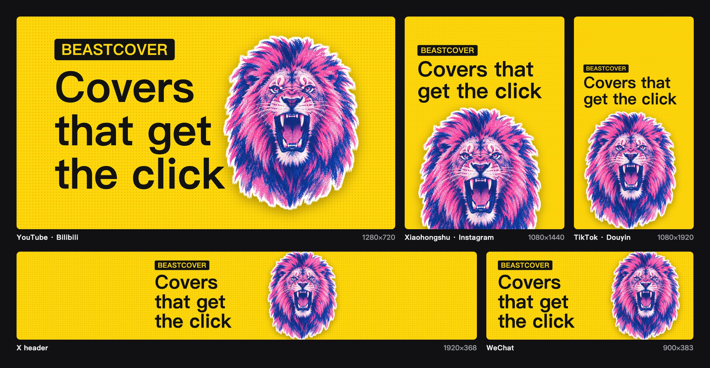

<p align="center"></p>

<h1 align="center">BeastCover</h1>

<p align="center"><b>Write the post. The cover comes free.</b></p>

<p align="center">
  <a href="https://liustack.dev">liustack.dev</a> ·
  <a href="./README.zh-CN.md">简体中文</a> ·
  <a href="./skills/beastcover/SKILL.md">Agent skill</a>
</p>

<p align="center">
  <a href="https://x.com/liustack"></a>
  <a href="https://www.npmjs.com/package/@liustack/beastcover"></a>
  <a href="https://nodejs.org"></a>
  <a href="LICENSE"></a>
  
</p>

## Install

```bash
npx -y skills add liustack/beastcover -g
```

Works with Claude Code, Codex, and any agent that reads a skill folder. Then tell it: "make a cover for this post."

## Talk to us

Issues are welcome any time. [Open one](https://github.com/liustack/beastcover/issues/new), or follow **[@liustack](https://x.com/liustack)** on X. Show the covers you made and tell us what the next release should fix. New releases land there first.

## Highlights

**🖼️ One sentence, one cover.** Your agent finds a photo you can use for free, lays the post's headline and palette over it, and renders a PNG on your machine.

**🆓 Free, and no API key.** Openverse is the default source, and it only returns CC0 and public domain photos, so there is nothing to credit. Add a Pexels key and Pexels goes first.

**📐 One command, every platform.** `--preset all` makes covers for WeChat, X, YouTube, Bilibili, Xiaohongshu, Instagram, Douyin, and TikTok at once, with the headline as big as each safe area allows.

**🔒 Your draft stays home.** Rendering happens in a local Chromium. The only network calls are the photo search and the photo download.

**🎨 Painted covers if you have a model CLI.** With Codex, Grok, or Claude CLI installed, you can paint a cover in one of four bold styles, on your own subscription.

## Commands

Your agent runs these for you. You can also run them yourself:

```bash
npm i -g @liustack/beastcover
npx --yes --package @liustack/beastcover playwright install chromium

beastcover new my-post
beastcover stock search "harbour night" --orientation landscape
beastcover gen "You can't catch the traffic you don't understand" --source stock --photo openverse:<id> --preset all
```

Install Chromium through the Playwright that ships with beastcover. A bare `npx playwright` can pick up an older copy from the npx cache and download a browser that does not match.

`stock search` prints one photo per line: ref, size, license, creator, thumbnail URL. Pick one and pass its ref to `--photo`. `--photo` also takes a local image path.

With a workspace, the photo and its provenance record land in `.beastcover/refs/` and the cover lands in `.beastcover/out/`. `project.json` holds the project's style and palette, `history.jsonl` records every cover, and both are safe to commit.

Photo covers are framed around the photo's own subject and keep it clear of the headline. `--look mono|duotone|punch` grades the photo, and `--fit extend` keeps a photo whole when its shape does not suit the platform, filling the rest with a blurred copy. With a model CLI, `--source local-model --remix me.jpg` redraws your image in the project style, and a second `--remix scene.jpg` puts you into that scene.

Add `--subject me.jpg` to put a person on the cover: they stand on one side with a white outline, and the headline moves to the other side. A transparent PNG is used as is. On macOS 14 or newer, a normal photo is cut out on your machine with the system's own subject cutout, so nothing is uploaded and your face is not redrawn. Elsewhere, cut the photo out first (iPhone and macOS "Copy Subject", remove.bg, Photoshop) and pass the PNG.

Without a photo, `--source render` makes a text-only cover. `--template poster` makes it loud: a full-bleed palette colour, huge type, and an optional `--tag`. `--template number --number 3` puts a huge figure beside a short line. `--template compare --before old.jpg --after new.jpg` splits two images with an arrow on the seam. Every template is fitted to every platform's safe area. With a model CLI, `--source local-model --via codex` paints a cover in the project style, and `beastcover styles` lists all four.

## Sizes

| Preset | Pixels | Use | Shares a master with |
| :-- | :-- | :-- | :-- |
| `youtube` | 1280×720 | YouTube thumbnail | `bilibili` |
| `bilibili` | 1146×717 | Bilibili video cover | `youtube` |
| `wechat` | 900×383 | WeChat article cover | `x` |
| `x` | 1920×368 | X article cover | `wechat` |
| `xiaohongshu` | 1080×1440 | Xiaohongshu note cover | the other portrait presets |
| `instagram` | 1080×1440 | Instagram post | the other portrait presets |
| `instagram-reels` | 1080×1920 | Instagram Reels cover | the other portrait presets |
| `douyin` | 1080×1920 | Douyin video cover | the other portrait presets |
| `tiktok` | 1080×1920 | TikTok video cover | the other portrait presets |

`--preset` takes one name, a comma list such as `wechat,x,douyin`, or `all`. Several presets write `<name>-<platform>.png`. The default is `youtube`.

Platforms with close ratios share one master, and each cover is cropped from it. The WeChat cover is the middle of the X banner, and the Xiaohongshu cover is the middle of the Douyin frame. The headline sits in the area every platform in the group shows and no app UI covers: the Douyin buttons, the YouTube duration badge, the Bilibili stats bar. Add `--guides` to draw that area on each cover and check the layout.

After rendering, BeastCover works out how big the headline will be in each platform's feed thumbnail and warns when it drops below 10px. A shorter headline reads bigger.

For a canvas no platform uses, set `--width` and `--height`. The old ratio names (`16:9`, `5:2`, `3:2`, `3:4`) are gone, and using one tells you which preset replaces it.

## Configuration

```bash
beastcover config set stock.pexels.apiKey <key>
beastcover config set render.preset xiaohongshu
beastcover config show
```

Settings live in `~/.beastcover/config.json` with file mode 0600, and `config show` masks every key. The Openverse `stock.openverse.clientId` and `clientSecret` are optional and only raise the rate limit.

## Network and privacy

| Source | What leaves your machine |
| :-- | :-- |
| `stock` | The search words, and the request that downloads the chosen photo |
| `render` | Nothing |
| `--subject` | Nothing. The cutout runs on your Mac |
| `local-model` | Goes through your own CLI and subscription. BeastCover never sees it |

Photo downloads connect straight to the image host, over https only, with private addresses blocked and a 40 MB cap per photo. A proxy set only through `HTTPS_PROXY` is not used. Proxies that take over DNS (fake-ip mode) work.

## Diagnosis

```bash
beastcover doctor
```

Runs offline and checks the Node.js version, Chromium, config file permissions, and whether `codex`, `grok`, or `claude` is on your PATH.

## Development

```bash
pnpm install
pnpm check
pnpm build
```

## License

MIT
