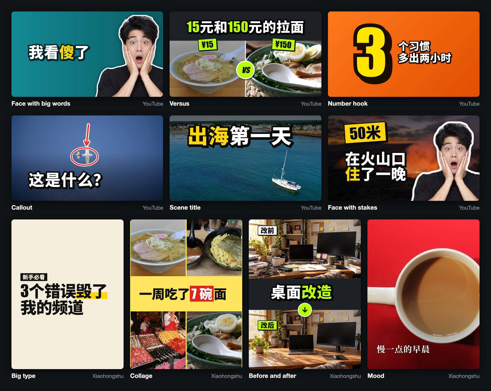

<p align="center"></p>

<h1 align="center">BeastCover</h1>

<p align="center"><b>The beast-mode generator for covers that get the click</b></p>

<p align="center">
  <a href="https://liustack.dev">liustack.dev</a> ·
  <a href="./README.zh-CN.md">简体中文</a> ·
  <a href="./skills/beastcover/SKILL.md">Agent skill</a> ·
  <a href="./examples/">Examples</a>
</p>

<p align="center">
  <a href="https://x.com/liustack"></a>
  <a href="https://www.npmjs.com/package/@liustack/beastcover"></a>
  <a href="https://nodejs.org"></a>
  <a href="LICENSE"></a>
  
</p>

Nobody reads your best work because nobody clicks it. In the feed your content is one thumbnail among thirty, and it wins or loses in a third of a second. A designer charges $50 a cover. Thumbnail SaaS wants $20–80 a month and only does YouTube. Canva wants forty minutes of dragging, once per platform.

Or: one sentence to the agent you already write with, and the cover is done. Every platform, sized right, nothing to set up, nothing to pay.

<p align="center"></p>

## Install

```bash
npx -y skills add liustack/beastcover -g
```

Works with Claude Code, Codex, and any agent that reads a skill folder. Then tell it: **"make a cover for this post."** The agent picks the hook, the photo, and the platforms from your content, and runs the CLI. No agent? The [CLI works on its own](#commands).

## What it makes

<p align="center">
  
  
</p>
<p align="center">
  
  
</p>

Every one is a single command, collected with the commands that made them in [examples/](examples/).

## Why these get clicked

The formulas are measured, not guessed, from breakout covers (90 top YouTube thumbnails measured pixel by pixel, 136 trending Bilibili covers, and the public 300k-video studies):

- **A face that carries the frame.** Breakout thumbnails put the face at a median 27% of frame height. BeastCover cuts your photo to head and shoulders on the machine and sizes it so the face is about 30%, with a white outline that separates it from any background.
- **A hook, not a title.** Covers with fewer words win. The CLI warns when your headline is long for a YouTube thumbnail or a Bilibili cover, and `--hook` puts the short line on video covers while WeChat and X keep the full title.
- **Bright and loud.** Dark thumbnails consistently lag. Poster backgrounds are full-bleed accent colours, and `--look punch` grades photos toward saturation and contrast.
- **Nothing lands under app UI.** Douyin's buttons, YouTube's duration badge, Bilibili's bottom bar, WeChat's forward crop: the headline and the subject are fitted inside what every requested platform actually shows, and the geometry is locked by tests.
- **Readable at 160 pixels.** After rendering, the CLI checks how big your headline is in each platform's feed thumbnail and warns when it drops below legibility.

## One command, every platform

```bash
beastcover gen "3个错误毁了我" --preset all
```

| Preset | Pixels | Use |
| :-- | :-- | :-- |
| `youtube` | 1280×720 | YouTube thumbnail |
| `bilibili` | 1146×717 | Bilibili video cover |
| `wechat` | 900×383 | WeChat article cover |
| `x` | 1600×640 | X article cover |
| `xiaohongshu` / `instagram` | 1080×1440 | Note and post covers |
| `instagram-reels` / `douyin` / `tiktok` | 1080×1920 | Vertical video covers |
| `og` | 1200×630 | Open Graph link preview |
| `github` | 1280×640 | GitHub social preview |

Platforms with close ratios share one master and are cropped from it; across shapes the cover is laid out again, so the subject never gets amputated. `--preset` takes one name, a comma list, or `all`.

## Free by default, yours to upgrade

| Path | Cost | What happens |
| :-- | :-- | :-- |
| Text covers (`--template text/poster/number/compare`) | Free | Rendered in a local Chromium, nothing leaves your machine |
| Photo covers (`--source stock`) | Free | CC0 and public-domain photos from Openverse, nothing to credit; a Pexels key is optional |
| Painted covers (`--source agent`) | Your existing subscription | Your Codex or agy CLI paints one of four catalog styles |
| Painted covers (`--source model`) | Your API key | GPT Image or Nano Banana, key in your config |

No accounts, no credits, no watermarks, no upsell. There is nothing to set up and nothing left behind: the cover lands in the directory you run from, downloaded photos and their license records stage in the system temp folder with their paths printed, and your project and your git stay untouched.

## Commands

```bash
npm i -g @liustack/beastcover
npx --yes --package @liustack/beastcover playwright install chromium

beastcover gen "我看傻了" --template poster --subject me.jpg --preset youtube,xiaohongshu
beastcover stock search "volcano helicopter" --orientation landscape
beastcover gen "离岩浆50米" --source stock --photo openverse:<id> --look punch --preset all
beastcover gen "深夜写代码的人" --source agent --via codex --style luminous_impasto
beastcover styles
```

Install Chromium through the Playwright that ships with beastcover: a bare `npx playwright` can pick up an older copy and download a browser that does not match.

`--subject` takes your photo: a transparent PNG is used as is, and on macOS 14+ a normal photo is cut out on your machine with the system's own segmentation, so nothing is uploaded and your face is never redrawn by a model. `--guides` draws every safe area on the cover when you want to check a layout. `--scale 3` renders a 4K YouTube thumbnail.

## Network and privacy

| Source | What leaves your machine |
| :-- | :-- |
| `render` | Nothing |
| `stock` | The search words, and the request that downloads the chosen photo |
| `--subject` | Nothing. The cutout runs on your Mac |
| `agent` | Goes through your own CLI and subscription. BeastCover never sees it |
| `model` | The style prompt and your subject line go to OpenAI or Gemini with your API key. No local file is uploaded |

Photo downloads connect straight to the image host, over https only, with private addresses blocked and a 40 MB cap per photo.

## Configuration

```bash
beastcover config set stock.pexels.apiKey <key>
beastcover config set model.openai.apiKey <key>
beastcover config set model.gemini.apiKey <key>
beastcover config show
```

Settings live in `~/.beastcover/config.json` with file mode 0600, and `config show` masks every key.

## Diagnosis

```bash
beastcover doctor
```

Runs offline and checks the Node.js version, Chromium, config file permissions, and whether `codex` or `agy` is on your PATH.

## Talk to us

Issues are welcome any time. [Open one](https://github.com/liustack/beastcover/issues/new), or follow **[@liustack](https://x.com/liustack)** on X. Show the covers you made and tell us what the next release should fix.

## Development

```bash
pnpm install
pnpm check
pnpm build
pnpm examples   # regenerate the example covers, then compare against git by eye
```

## License

MIT
