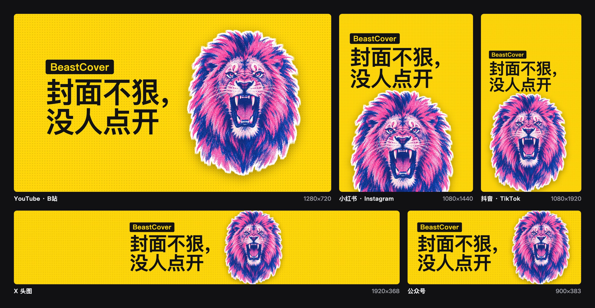

<p align="center"></p>

<h1 align="center">BeastCover</h1>

<p align="center"><b>文章写完，封面顺手就有</b></p>

<p align="center">
  <a href="https://liustack.dev">liustack.dev</a> ·
  <a href="./README.md">English</a> ·
  <a href="./skills/beastcover/SKILL.md">Agent skill</a>
</p>

<p align="center">
  <a href="https://x.com/liustack"></a>
  <a href="https://www.npmjs.com/package/@liustack/beastcover"></a>
  <a href="https://nodejs.org"></a>
  <a href="LICENSE"></a>
  
</p>

## 安装

```bash
npx -y skills add liustack/beastcover -g
```

装进 Claude Code、Codex，或任何读 skill 文件夹的 agent。装好后跟它说「给这篇文章做个封面」。

## 交流

欢迎随时提 [issue](https://github.com/liustack/beastcover/issues/new)。也欢迎在 X 关注 **[@liustack](https://x.com/liustack)**，晒晒你做的封面，说说下一版最该解决什么。新版本会第一时间在那里发。

## 亮点

**🖼️ 一句话出封面。** agent 先搜一张能免费商用的照片，再把这篇文章的标题和配色压上去，在你电脑上渲染成 PNG。

**🆓 不花钱，不用 key。** 默认走 Openverse，只收 CC0 和公有领域的照片，拿来就能用，也不用署名。配了 Pexels key 就优先用 Pexels。

**📐 一条命令，全平台出齐。** `--preset all` 一次出公众号、X、YouTube、B 站、小红书、Instagram、抖音、TikTok 的封面，外加网页的 OG 分享图和 GitHub 预览图，标题在每个平台的安全区里尽量放大。

**🔒 稿子不出电脑。** 渲染在本机 Chromium 里完成，联网的只有搜图和下载照片。

**🎨 有模型 CLI 还能画封面。** 装了 Codex、Grok 或 Claude CLI，就能用四种高冲击画风画封面，花的是你自己的订阅。

## 命令

agent 会替你跑这些命令。想自己动手也行：

```bash
npm i -g @liustack/beastcover
npx --yes --package @liustack/beastcover playwright install chromium

beastcover new my-post
beastcover stock search "harbour night" --orientation landscape
beastcover gen "人接不住认知以外的流量，也赚不到认知以外的钱" --source stock --photo openverse:<id> --preset all
```

浏览器要用 beastcover 自带的 Playwright 来装，直接 `npx playwright` 可能拿到 npx 缓存里的旧版本，装出来的 Chromium 对不上。

`stock search` 每行列一张照片：ref、尺寸、授权、作者、缩略图地址。挑一张，把 ref 交给 `--photo`。`--photo` 也收本地图片路径。

有工作区时，照片和它的来源记录存进 `.beastcover/refs/`，封面写到 `.beastcover/out/`。`project.json` 记着这个项目的风格和配色，`history.jsonl` 记着每一张封面，两个文件都可以提交。

照片封面会按照片自己的主体来构图，让主体避开标题。`--look mono|duotone|punch` 给照片调色，`--fit extend` 在照片形状不适合平台时保留整张照片，其余部分用模糊的同一张补满。装了模型 CLI 的话，`--source local-model --remix me.jpg` 按项目画风重绘你的图，再加一个 `--remix 场景.jpg` 就能把你放进那个场景。

加上 `--subject me.jpg` 就能把人放上封面：人站在一侧，带白描边，标题让到另一侧。给透明 PNG 直接用。在 macOS 14 及以上，普通照片会用系统自带的抠图在本机抠好，不上传，也不会被模型重画脸。其他系统请先抠好（iPhone 和 Mac 的「拷贝主体」、remove.bg、Photoshop 都行）再把 PNG 给它。

不要照片的话，`--source render` 出纯文字封面。`--template poster` 是大字报：满版纯色、超大字，可以用 `--tag` 加一个痛点标签。`--template number --number 3` 是数字钩子：一个超大数字配一句短话。`--template compare --before 旧.jpg --after 新.jpg` 是前后对比：两张图分屏，接缝处一个箭头。每个模板都会按各平台的安全区排版。装了模型 CLI 的话，`--source local-model --via codex` 按项目风格画封面，`beastcover styles` 列出四种画风。

## 尺寸

| 预设 | 像素 | 用在哪 | 和谁共用母版 |
| :-- | :-- | :-- | :-- |
| `youtube` | 1280×720 | YouTube 缩略图 | `bilibili`、`og`、`github` |
| `bilibili` | 1146×717 | B 站视频封面 | `youtube`、`og`、`github` |
| `wechat` | 900×383 | 公众号文章封面 | `x` |
| `x` | 1920×368 | X 文章封面 | `wechat` |
| `xiaohongshu` | 1080×1440 | 小红书笔记封面 | 其他竖版预设 |
| `instagram` | 1080×1440 | Instagram 帖子 | 其他竖版预设 |
| `instagram-reels` | 1080×1920 | Instagram Reels 封面 | 其他竖版预设 |
| `douyin` | 1080×1920 | 抖音视频封面 | 其他竖版预设 |
| `tiktok` | 1080×1920 | TikTok 视频封面 | 其他竖版预设 |
| `og` | 1200×630 | 网页的 Open Graph 分享图 | `youtube`、`bilibili`、`github` |
| `github` | 1280×640 | GitHub 仓库的社交预览图 | `youtube`、`bilibili`、`og` |

`--preset` 可以给一个名字、逗号分隔的列表（比如 `wechat,x,douyin`），或者 `all`。出多张时文件名是 `<名字>-<平台>.png`。默认是 `youtube`。

比例接近的平台共用一张母版，每张封面从母版里裁出来：公众号封面就是 X 横幅的中间一段，小红书封面就是抖音画面的中间一段。标题放在同组平台都看得见、又不被界面挡住的区域里，比如抖音右侧的按钮、YouTube 右下角的时长、B 站底部的播放数据。加 `--guides` 会把这块区域画在每张封面上，方便检查排版。

出完图，BeastCover 会算出标题在各平台信息流缩略图里有多大，小于 10px 时提示你。标题越短，字越大。

要用平台以外的画布，直接给 `--width` 和 `--height`。旧的比例名（`16:9`、`5:2`、`3:2`、`3:4`）已经去掉，用到时会提示改用哪个预设。

## 配置

```bash
beastcover config set stock.pexels.apiKey <key>
beastcover config set render.preset xiaohongshu
beastcover config show
```

配置存在 `~/.beastcover/config.json`，文件权限 0600，`config show` 会把所有 key 遮住。Openverse 的 `stock.openverse.clientId` 和 `clientSecret` 可以不填，填了只是提高限额。

## 网络与隐私

| 图源 | 什么会离开你的电脑 |
| :-- | :-- |
| `stock` | 搜索词，以及下载所选照片的请求 |
| `render` | 什么都不出去 |
| `--subject` | 什么都不出去，抠图在你的 Mac 上完成 |
| `local-model` | 走你自己的 CLI 和订阅，我们不经手 |

照片下载直连图片服务器，只认 https，内网地址一律拦下，单张上限 40MB。只靠 `HTTPS_PROXY` 设的代理用不上，接管 DNS 的代理（fake-ip 模式）可以正常下载。

## 诊断

```bash
beastcover doctor
```

不联网，检查 Node.js 版本、Chromium、配置文件权限，以及本机有没有 `codex`、`grok`、`claude`。

## 开发

```bash
pnpm install
pnpm check
pnpm build
```

## License

MIT
