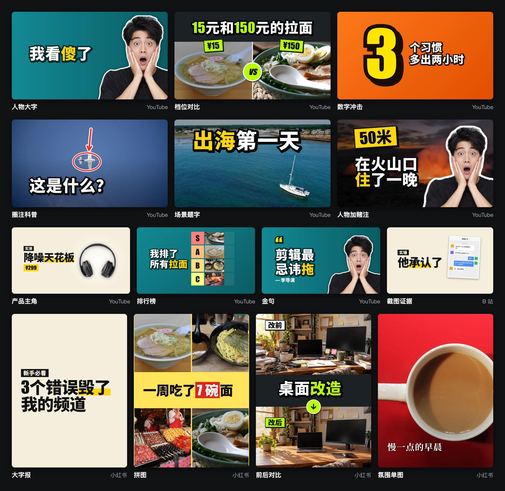

<p align="center"></p>

<h1 align="center">BeastCover</h1>

<p align="center"><b>全网最强爆款封面生成器</b></p>

<p align="center">
  <a href="https://liustack.dev">liustack.dev</a> ·
  <a href="./README.md">English</a> ·
  <a href="./skills/beastcover/SKILL.md">Agent skill</a> ·
  <a href="./examples/">案例</a> ·
  <a href="./docs/packaging.zh-CN.md">包装</a>
</p>

<p align="center">
  <a href="https://x.com/liustack"></a>
  <a href="https://www.npmjs.com/package/@liustack/beastcover"></a>
  <a href="https://nodejs.org"></a>
  <a href="LICENSE"></a>
  
</p>

你最好的内容没人看，是因为没人点。信息流里你的封面只是三十张缩略图里的一张，胜负在零点三秒内分出。请设计师，一张 50 美元。缩略图 SaaS，每月 20 到 80 美元，还只做 YouTube。开 Canva 拖模板，四十分钟，一个平台拖一遍。

或者：对你已经在用的 agent 说一句话，封面就好了。全平台、尺寸全对、零配置、零付费。

<p align="center"></p>

## 安装

```bash
npx -y skills add liustack/beastcover -g
```

Claude Code、Codex 以及任何认技能目录的 agent 都能用。装完对它说一句：**「给这篇配个封面」**。agent 会从你的内容里提炼钩子、挑照片、定平台，然后跑命令。不用 agent？[CLI 可以单独用](#命令)。

## 它做出来的东西

每个平台的爆款封面都不止一种。BeastCover 做其中十种，你没指定时按你给的素材挑一种：

<p align="center">
  
  
  
</p>
<p align="center">
  
  
  
</p>
<p align="center">
  
  
  
  
  
</p>

大字报、数字冲击、人物大字、人物加赌注、档位对比、前后对比、场景题字、圈注科普、拼图、氛围单图。每张都是一条命令，命令和成品都收在 [examples/](examples/)。

## 为什么这些图有人点

公式是量出来的，不是猜的（逐像素测过 90 张 YouTube 头部缩略图、136 张 B 站热门封面，加上公开的 30 万条视频研究）：

- **画面讲故事。** 封面赢在点子：赌注、前后、二选一、一个值得看的东西。每种封面类型都是为画出其中一种而做的，不是把标题贴上墙。
- **字有工艺。** 描边加硬投影压在任何底上都清楚，一个关键词换强调色或压荧光笔（写成 `*这样*`），字体用你机器上装的最粗的中文字体，不够粗时告诉你装什么。
- **脸要撑起画面。** 爆款缩略图的脸高中位数占画面 27%。BeastCover 在本机把你的照片裁到头肩、按脸定大小放大到约 30%，白描边把人从任何背景里剥出来。
- **封面句是钩子，不是标题。** 字越少越赢。标题太长时 CLI 会提醒，`--hook` 让视频封面用短句、公众号和 X 保留全标题。
- **亮，撞色。** 暗图一贯落后。六套配色都是一个强底色配一个强调色，`--look punch` 把照片往高饱和高对比调。
- **不压在 App 界面下面。** 抖音的按钮、YouTube 的时长角标、B 站的底栏、公众号的转发裁切：标题和主体只放在每个平台真正露出来的区域里，几何有测试锁死。
- **交付前先质检。** 出图后每张都在本机查一遍：标题不能压住脸、人、照片里的字和主体，不能压在花的地方，缩到信息流大小还要读得清。不过关的标红，换一个位置能过就自动挪过去，另出一张预览图，把每张按信息流大小摆在一起给你看。

## 一条命令，全平台

```bash
beastcover gen "3个错误毁了我" --preset all
```

| 预设 | 像素 | 用途 |
| :-- | :-- | :-- |
| `youtube` | 1280×720 | YouTube 缩略图 |
| `bilibili` | 1146×717 | B 站视频封面 |
| `wechat` | 900×383 | 公众号文章封面 |
| `x` | 1600×640 | X 文章封面 |
| `xiaohongshu` / `instagram` | 1080×1440 | 笔记和帖子封面 |
| `instagram-reels` / `douyin` / `tiktok` | 1080×1920 | 竖版视频封面 |
| `og` | 1200×630 | 网页分享卡片 |
| `github` | 1280×640 | GitHub 社交预览 |

比例接近的平台共用一张母版裁切，比例差得远就整个重新排版，主体永远不会被切掉。`--preset` 接一个名字、逗号列表或 `all`。

## 默认免费，升级自带

| 路径 | 花费 | 说明 |
| :-- | :-- | :-- |
| 十种封面类型（`--template`） | 免费 | 本地 Chromium 渲染，什么都不出机器 |
| 照片（`--photo`） | 免费 | 你自己的，或 Openverse 的 CC0 和公有领域照片。Pexels key 可选 |
| 现画场景（`--scene`） | 你的 key 或订阅 | 没有照片时，用你的图像 API key 或你的 Codex、agy CLI 画场景。都没有就退到配色渐变并告诉你 |
| 画出来的封面（`--source agent`） | 你已有的订阅 | 你的 Codex 或 agy CLI 按四个目录风格作画 |
| 画出来的封面（`--source model`） | 你的 API key | GPT Image 或 Nano Banana，key 放你自己的配置 |

没有账号、没有积分、没有水印、没有推销。没有任何要初始化的东西，也不留任何痕迹：封面落在你运行命令的目录里，下载的照片和授权记录暂存在系统临时目录（路径会打印出来），你的项目和 git 完全不被碰。

## 命令

```bash
npm i -g @liustack/beastcover
npx --yes --package @liustack/beastcover playwright install chromium

beastcover gen "我看*傻*了" --subject me.jpg --preset youtube,xiaohongshu
beastcover gen "个习惯救了我的时间" --template number --number 3 --preset all
beastcover stock search "ramen bowl" --orientation landscape
beastcover gen "15元和150元的拉面" --template versus --photo openverse:<id> --photo openverse:<id> --labels "¥15,¥150"
beastcover gen "在火山口*住*了一晚" --subject me.jpg --scene "a volcano crater at dusk, a tent on the rim" --number "50米"
beastcover gen "深夜写代码的人" --source agent --via codex --style luminous_impasto
beastcover styles
```

Chromium 要用 beastcover 自带的 Playwright 装：裸的 `npx playwright` 可能解析到旧版本，下载一个对不上的浏览器。

`--template` 选封面类型，`--scheme` 选配色，什么内容配什么类型见[技能说明](skills/beastcover/SKILL.md)。`--subject` 收你的照片：透明 PNG 直接用，macOS 14+ 上普通照片用系统自带的抠图在本机抠，什么都不上传，脸也绝不会被模型重画。`--guides` 把所有安全区画在封面上供检查。`--scale 3` 出 4K 的 YouTube 缩略图。

## 联网与隐私

| 来源 | 什么会离开你的机器 |
| :-- | :-- |
| `render` | 什么都不会 |
| `stock` | 搜索词，和下载所选照片的那一个请求 |
| `--subject` | 什么都不会，抠图在你的 Mac 上跑 |
| `--scene` | 场景描述带着你的 key 发给你的图像 API，或交给你自己的 agent CLI |
| `agent` | 走你自己的 CLI 和订阅，BeastCover 碰不到 |
| `model` | 风格提示词和主体描述带着你的 key 发给 OpenAI 或 Gemini，不上传任何本地文件 |

照片下载直连图片主机，只走 https，私网地址被拦，单张上限 40 MB。

## 配置

```bash
beastcover config set stock.pexels.apiKey <key>
beastcover config set model.openai.apiKey <key>
beastcover config set model.gemini.apiKey <key>
beastcover config show
```

配置在 `~/.beastcover/config.json`，文件权限 0600，`config show` 会把所有 key 打码。

## 诊断

```bash
beastcover doctor
```

离线运行，检查 Node.js 版本、Chromium、配置文件权限、`codex` 或 `agy` 在不在 PATH 上，以及 `--scene` 会用什么画。

## 聊聊

随时欢迎提 issue：[开一个](https://github.com/liustack/beastcover/issues/new)，或在 X 上关注 **[@liustack](https://x.com/liustack)**。晒出你做的封面，告诉我们下个版本该修什么。

## 开发

```bash
pnpm install
pnpm check
pnpm build
pnpm examples   # 重新生成案例封面，然后和 git 里的旧图目检对比
```

## 许可

MIT
