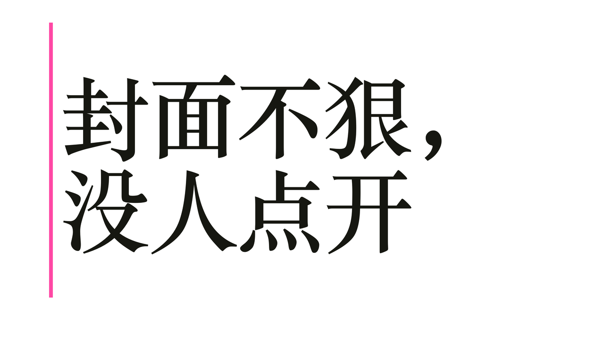
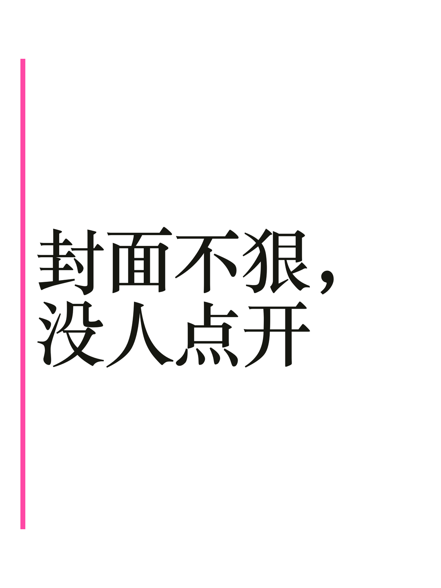
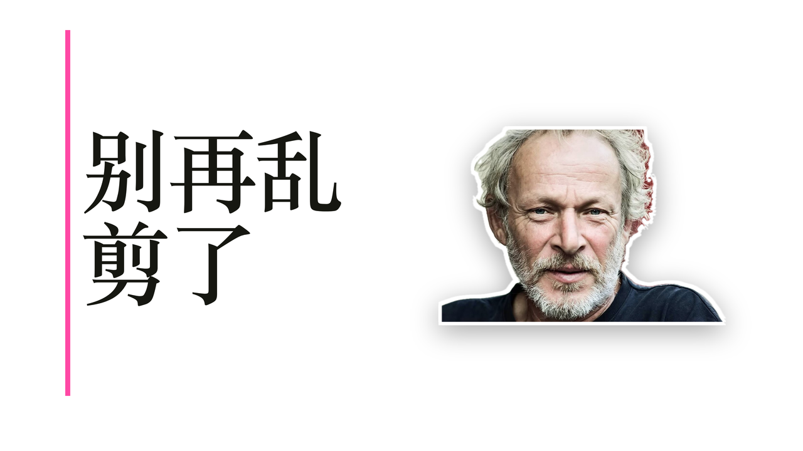
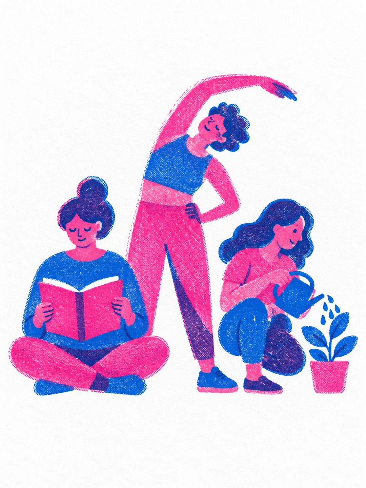

# Examples

Every cover below was made by one `beastcover` command, shown above it. Photos come from Openverse and are all CC0 or public domain. The `agent` covers were painted through a local agent CLI; everything else is the free path and regenerates with `pnpm examples`.

This folder doubles as the visual regression set: after changing a template or the layout, run `pnpm examples` and compare the changed files against git before committing.

## One headline, every platform

The same headline rendered for YouTube and Xiaohongshu. Platforms with close ratios share one master; across families the cover is laid out again for the new shape.

```bash
beastcover gen "封面不狠，没人点开" --source render --preset youtube,xiaohongshu
```

 

## Poster

Full-bleed palette colour, huge type, and a `--tag` above the headline.

```bash
beastcover gen "封面没人点" --source render --template poster --tag "新手必看" --preset xiaohongshu
```


## Number

A huge figure beside a short line.

```bash
beastcover gen "个习惯多出两小时" --source render --template number --number 3 --preset youtube
```


## Compare

Two images split by an arrow on the seam, with a label on each side.

```bash
beastcover gen "下一站" --source render --template compare --before sea.jpg --after sky.jpg --labels "海上,天上" --preset youtube
```


## Photo cover

A free stock photo, framed around its own subject, with the headline on the calm part. This one is the ultrawide X article cover.

```bash
beastcover gen "The tide comes back" --source stock --photo openverse:d788f4c8-9d3d-40cf-8784-02d2573ce9a0 --preset x
```


## Callout

The photo's subject circled in red with an arrow from the empty side.

```bash
beastcover gen "看这里" --source stock --photo openverse:5f19ac60-f04c-4504-9d94-4a846c503566 --callout --preset youtube
```


## A person on the cover

A photo cut out on the machine (macOS Vision), cropped to head and shoulders, sized by the face.

```bash
beastcover gen "别再乱剪了" --source render --subject portrait.jpg --preset youtube
```



## Painted through your own agent CLI

The project style prompt painted by a local agent CLI. Not part of `pnpm examples`: repaint by hand when the style changes. Stored as jpeg to keep the repository small.

```bash
beastcover gen "三个习惯" --source agent --via agy --preset youtube
beastcover gen "三个习惯" --source agent --via codex --preset xiaohongshu
```

 

## Photo credits

All photos via [Openverse](https://openverse.org), CC0 or public domain: [sailboat](https://stocksnap.io/photo/sailing-boat-6HIAAM72PR), [airplane](https://stocksnap.io/photo/airplane-sky-YNUT4JAZ0V), [portrait](https://www.flickr.com/photos/63463750@N02/19581519915) by Noval Goya.
