# Examples

Every cover below came out of one `beastcover` command, shown above it, and passed the checks the CLI runs after rendering. This folder is also the visual regression set: after changing a cover type or the layout, run `pnpm examples` and compare the changed files against git by eye. The script stops if any example fails QC.

Photos come from Openverse (CC0, credits at the bottom). The face is an AI-generated demo person, stored as the input asset `assets/face.jpg`: in real use this is where your own photo goes.

## Big type

The words are the picture. Heavy type on cream paper, one keyword under a marker stroke, a small tag above.

```bash
beastcover gen "3个错误*毁了*我的频道" --template big-type --tag "新手必看" --preset xiaohongshu,wechat
```

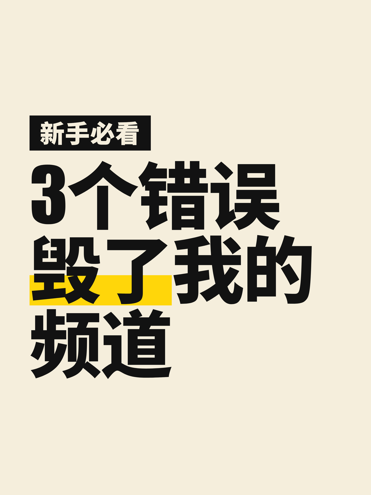 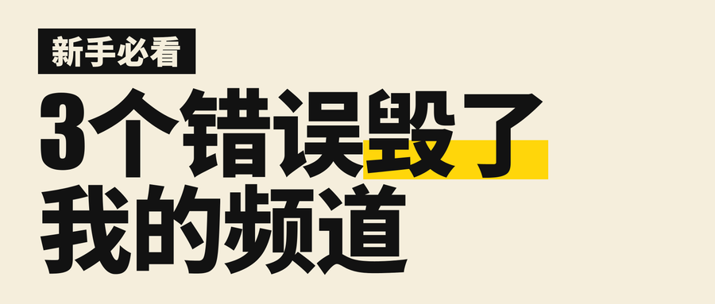

## Number hook

One huge figure beside a short line. The figure box is sized to the figure, so a single digit does not leave a hole on the left.

```bash
beastcover gen "个习惯救了我的时间" --template number --number 3 --preset youtube,douyin
```

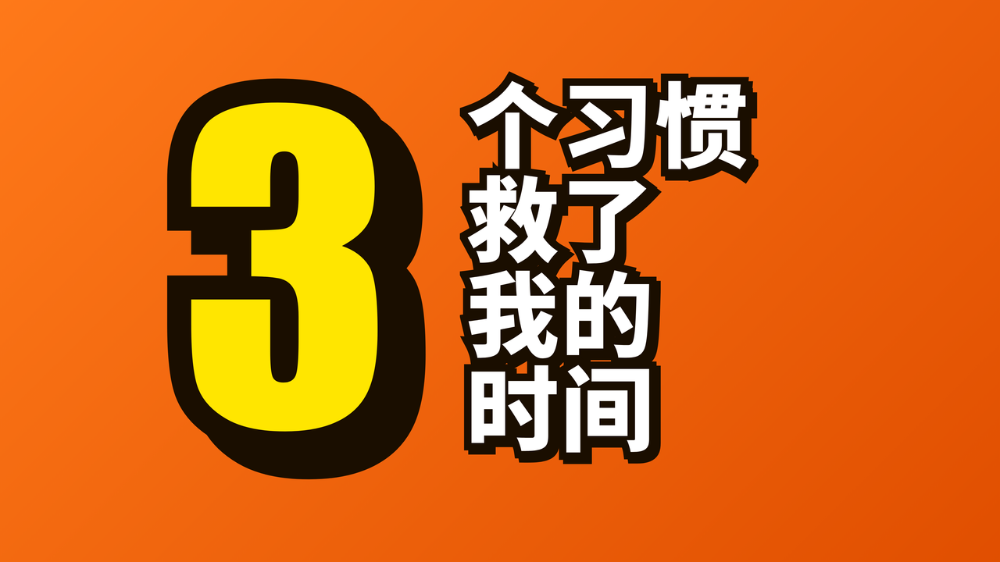 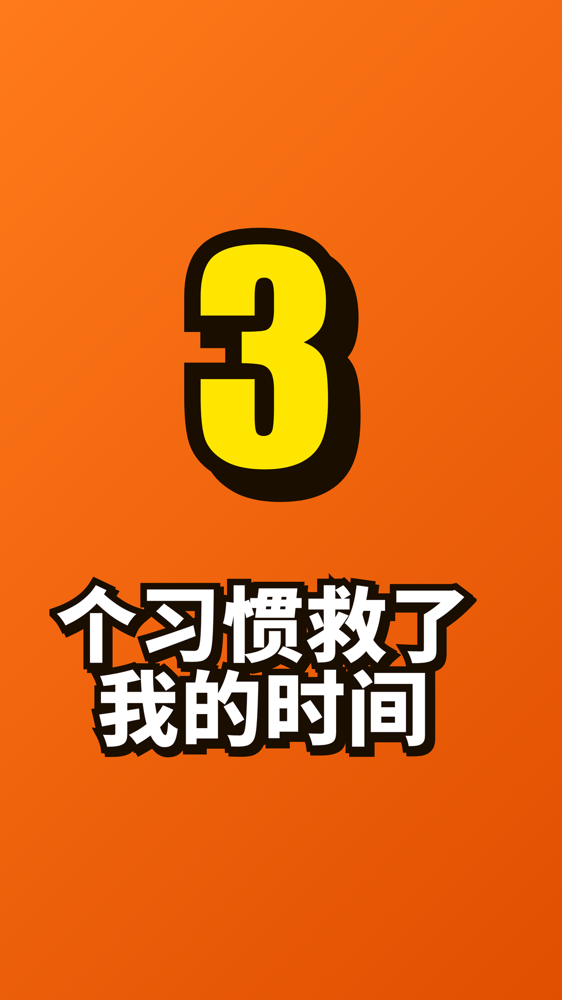

## Face with big words

A face cut out on the machine, sized so it carries the frame, on a cool gradient that makes warm skin stand out. Two to four words on the other side.

```bash
beastcover gen "我看*傻*了" --subject your-photo.jpg --preset youtube,xiaohongshu
```

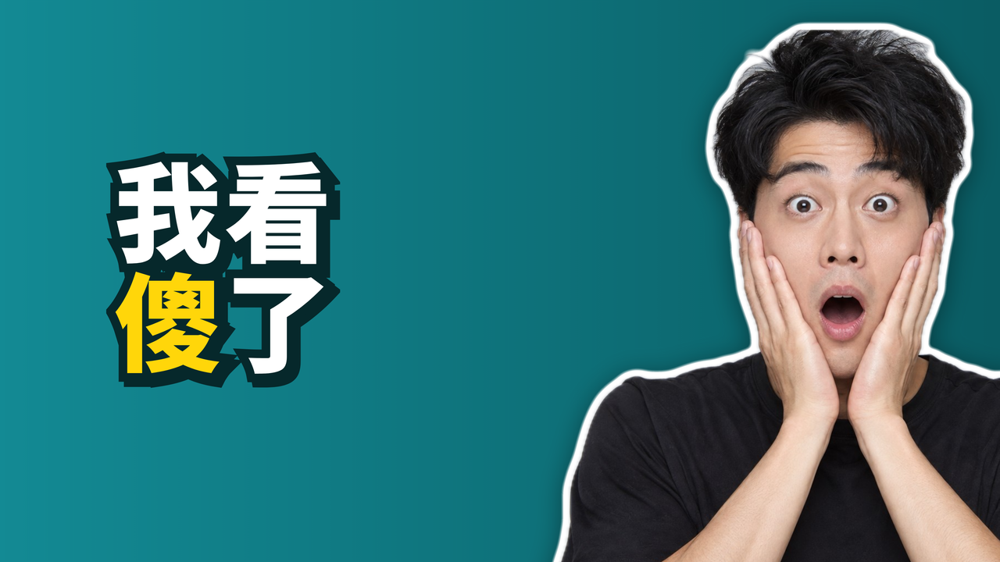 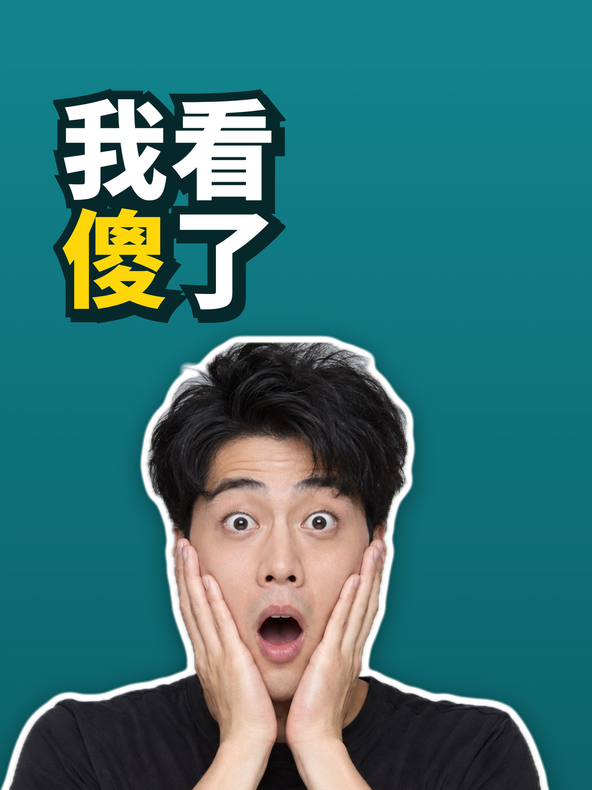

## Face with stakes

The person inside the scene of the story, the scene blurred and darkened on the headline side, the stakes on a tilted sign. The first cover uses a free stock photo. The second had no photo: `--scene` described the picture and the user's own codex CLI painted it.

```bash
beastcover gen "离岩浆*50米*" --subject your-photo.jpg --photo openverse:ffe36656-7f80-45fe-a390-ab5b50aa2906 --number "DAY 1" --preset youtube
beastcover gen "在火山口*住*了一晚" --subject your-photo.jpg --scene "an active volcano crater at dusk, glowing orange lava pool, a small camping tent on dark rock at the rim" --number "50米" --preset youtube
```

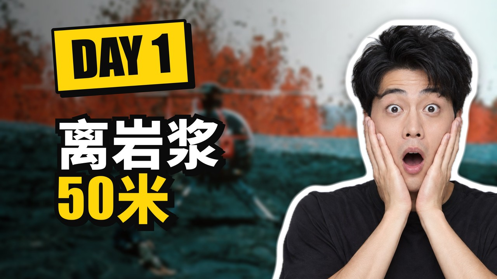 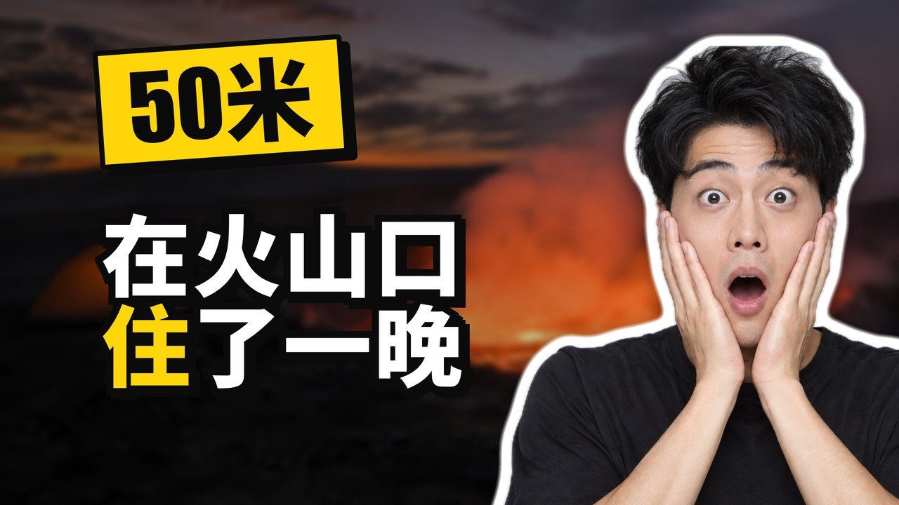

## Versus

Two equal halves, their brightness evened out so neither side wins by lighting, a price tag on each and a VS badge in the seam. The headline sits on its own band, never across the photos.

```bash
beastcover gen "15元和150元的拉面" --template versus --photo openverse:0f89f9cc-d7fd-4828-bcb4-a2b0b5e390be --photo openverse:a01ecc5c-176b-4d1f-a445-655ff2184e3a --labels "¥15,¥150" --preset youtube
```

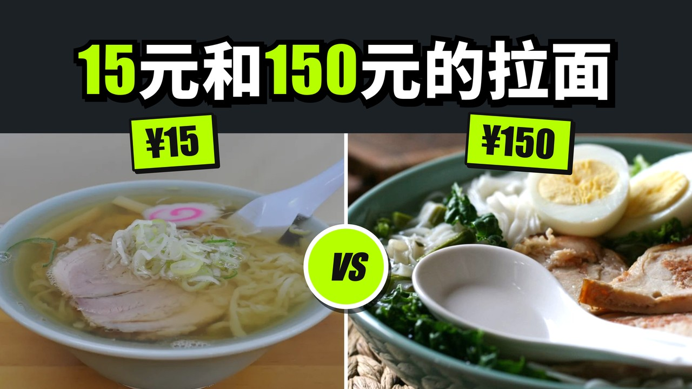

## Before and after

Before on top, after below on a portrait cover (left and right on landscape), the headline band in the seam.

```bash
beastcover gen "桌面*改造*" --template before-after --photo openverse:db683a42-45c4-4715-97cc-318a86cc568e --photo openverse:19f89def-c920-4e19-bc37-c20a2dedaa5a --labels "改前,改后" --preset xiaohongshu
```

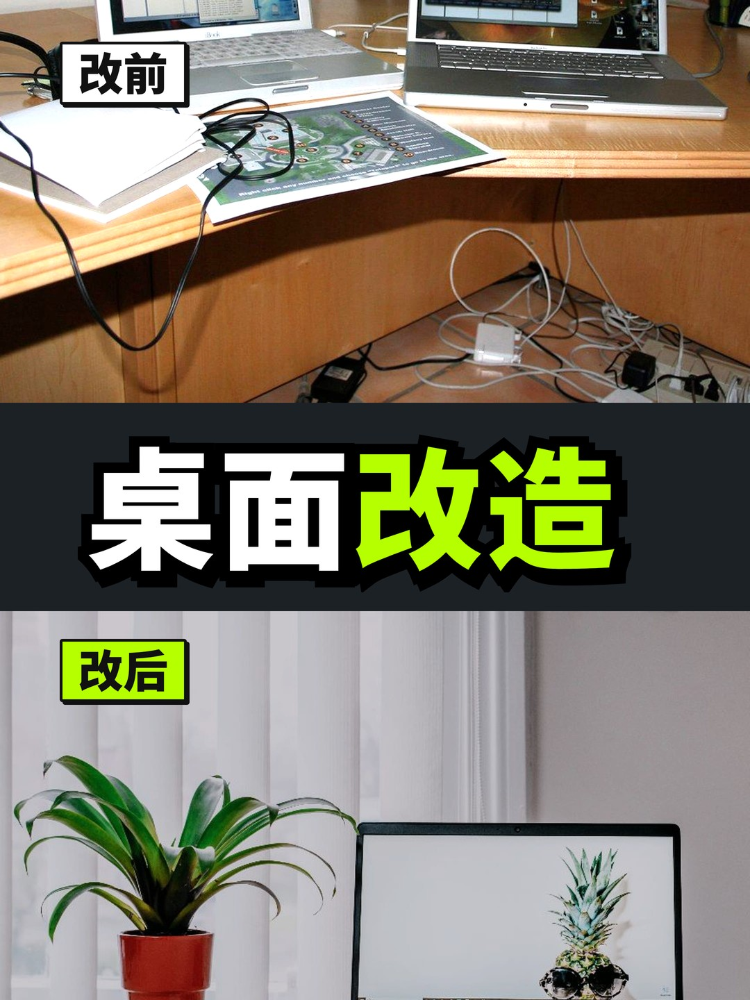

## Scene title

A full-bleed scene with an outlined title. The title started at the bottom, where it covered the boat, so the CLI moved it to the calm water at the top.

```bash
beastcover gen "*出海*第一天" --template scene-title --photo openverse:d788f4c8-9d3d-40cf-8784-02d2573ce9a0 --preset bilibili,x
```

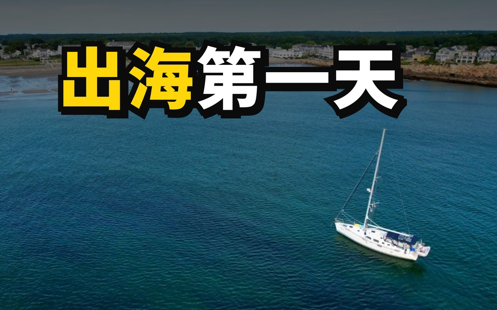 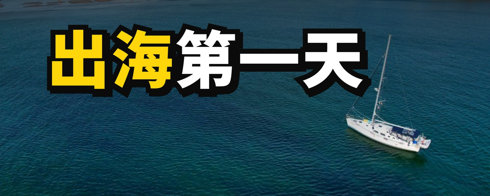

## Callout

The photo's subject circled in red with an arrow from the empty side, the way science channels mark the thing to look at.

```bash
beastcover gen "这是什么？" --template callout --photo openverse:5f19ac60-f04c-4504-9d94-4a846c503566 --preset youtube
```

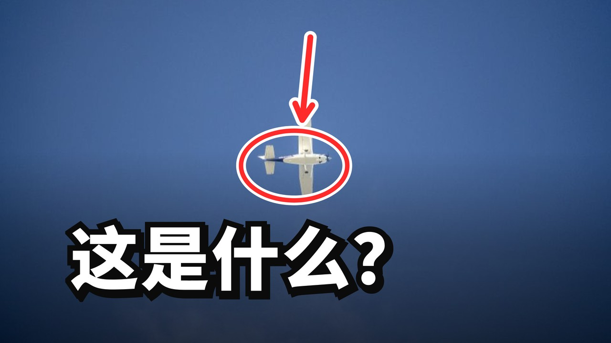

## Collage

Four photos in a grid, one colour grade over all of them, the title on a yellow band.

```bash
beastcover gen "一周吃了*7碗*面" --template collage --photo openverse:0f89f9cc-d7fd-4828-bcb4-a2b0b5e390be --photo openverse:1ba9b26d-990f-4c66-ba15-f2cc8cabb41b --photo openverse:3db8719f-ce9f-4ed3-bc27-0ee02624fe3e --photo openverse:a01ecc5c-176b-4d1f-a445-655ff2184e3a --preset xiaohongshu
```

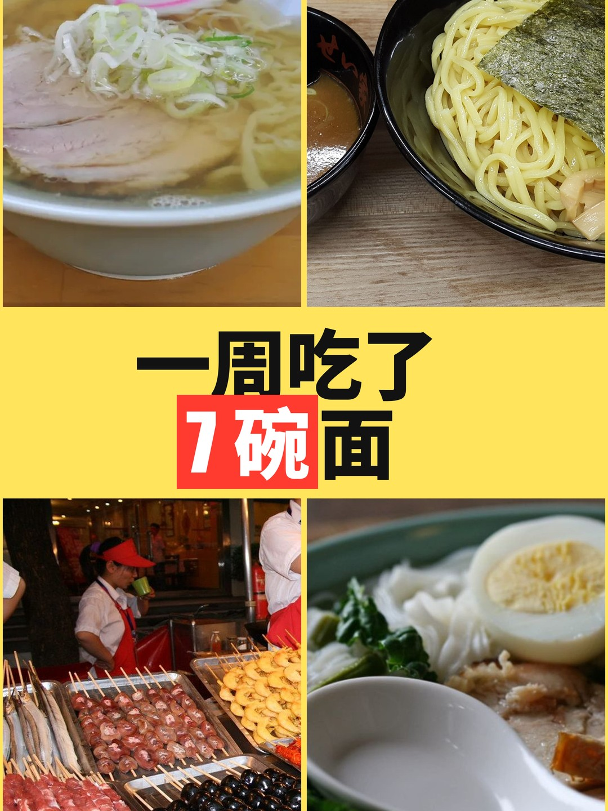

## Mood

One photo that is the reason to open, and a small, quiet line.

```bash
beastcover gen "慢一点的早晨" --template mood --photo openverse:278488ee-cc5d-49d9-84bb-de0281b20f60 --preset xiaohongshu
```

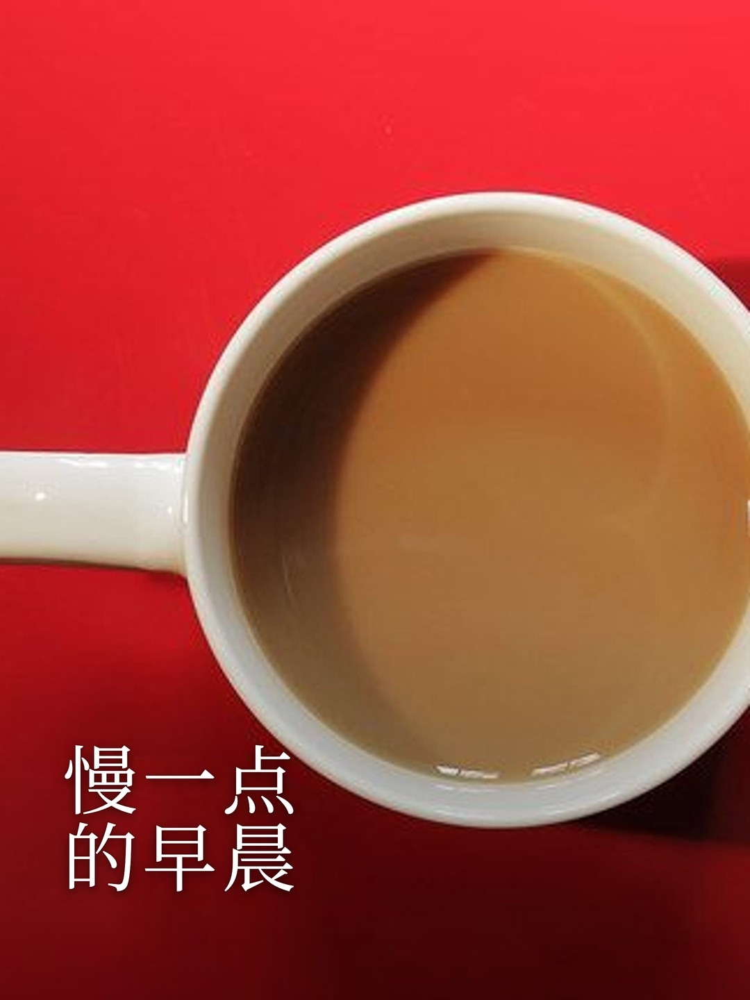

## Painted through your own agent CLI

The whole cover painted in a catalog style by a local agent CLI (`--via agy` here). Not part of `pnpm examples`: repaint by hand when a style changes.

```bash
beastcover gen "一个人独自坐在深夜的书桌前，屏幕的光照亮他的脸" --source agent --via agy --style luminous_impasto --preset youtube
beastcover gen "三个习惯" --source agent --via agy --preset youtube
```

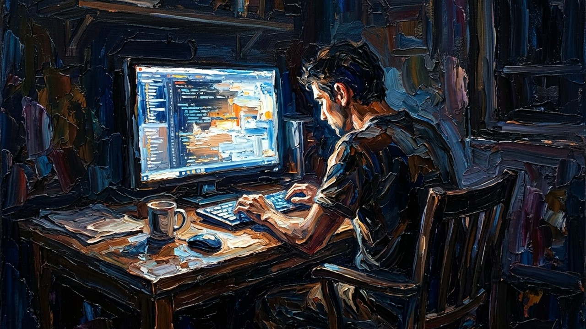 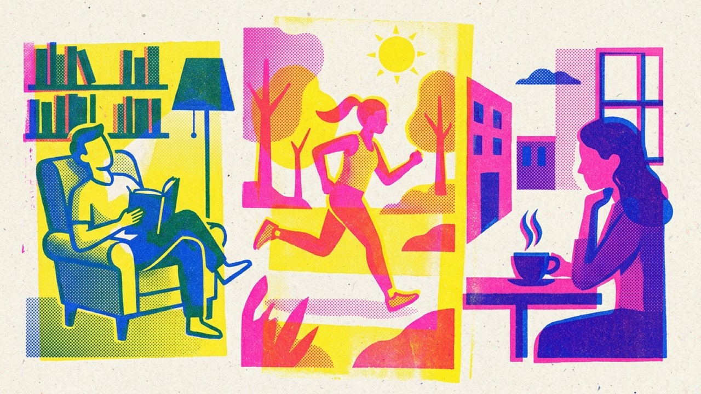

## Credits

Photos via [Openverse](https://openverse.org), all CC0: [lava and helicopter](https://www.flickr.com/photos/27784370@N05/16285896735) by U.S. Geological Survey, [sailboat](https://stocksnap.io/photo/sailing-boat-6HIAAM72PR) by JJ Skys the Limit, [airplane](https://stocksnap.io/photo/airplane-sky-YNUT4JAZ0V) by Matt Bango, [ramen](https://www.rawpixel.com/image/5925771/photo-image-public-domain-food-free) via rawpixel, [ramen with egg](https://stocksnap.io/photo/ramen-noodles-KKMQPWQK6H) by Foodie Girl, [tsukemen](https://commons.wikimedia.org/w/index.php?curid=39923890) by Douglas Perkins, [night market](https://www.flickr.com/photos/101561334@N08/9870511026) by Gary Lee Todd, [cluttered desk](https://www.flickr.com/photos/37996646802@N01/132287095) by cogdogblog, [clean desk](https://stocksnap.io/photo/laptop-desk-JCXQS3IVWD) by Lisa Fotios, [coffee](https://www.flickr.com/photos/132795455@N08/17625638243) via Image Catalog. The demo face is AI-generated. No real person appears in these covers. The volcano scene was painted by codex for this example.
