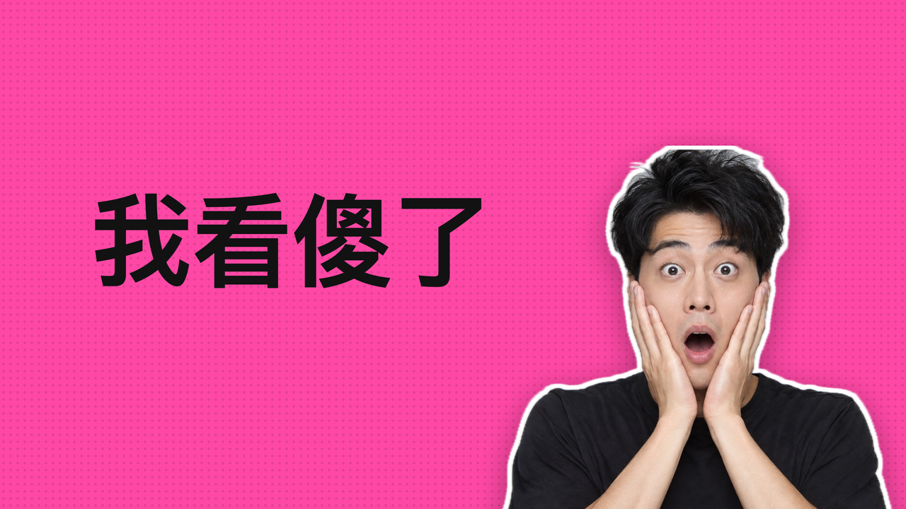
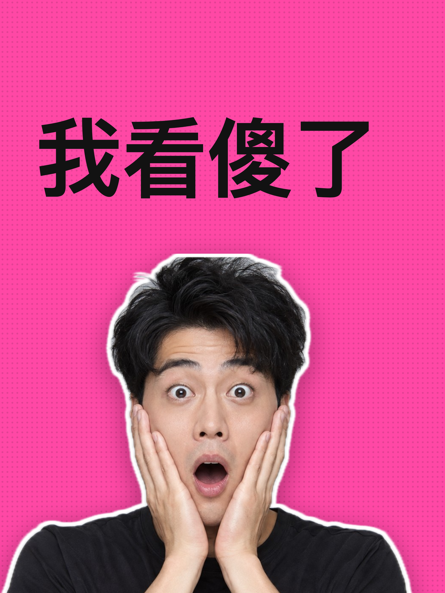
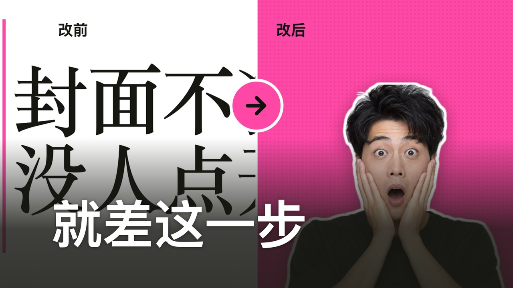
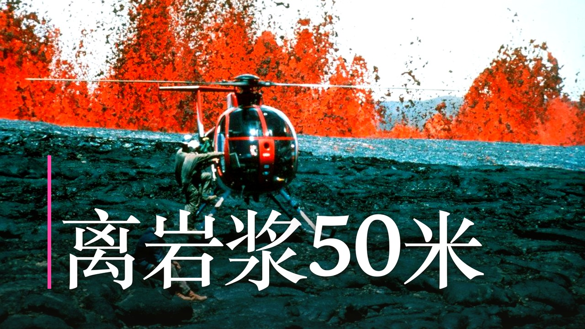
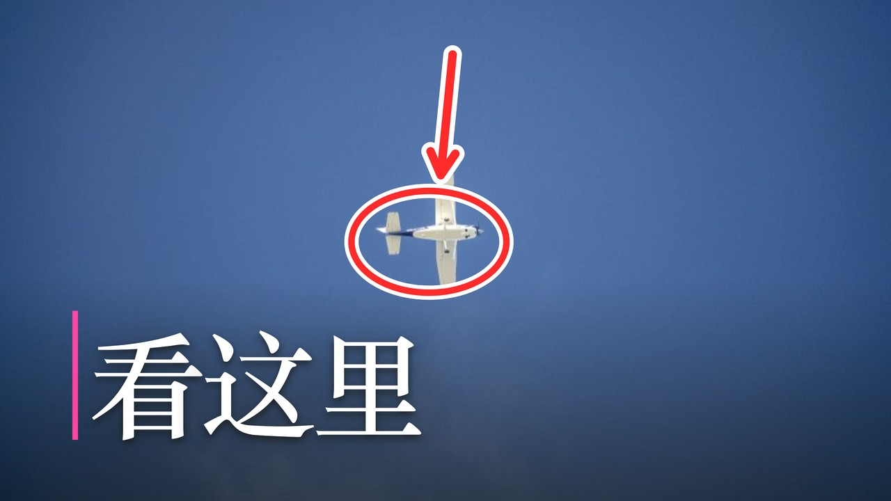
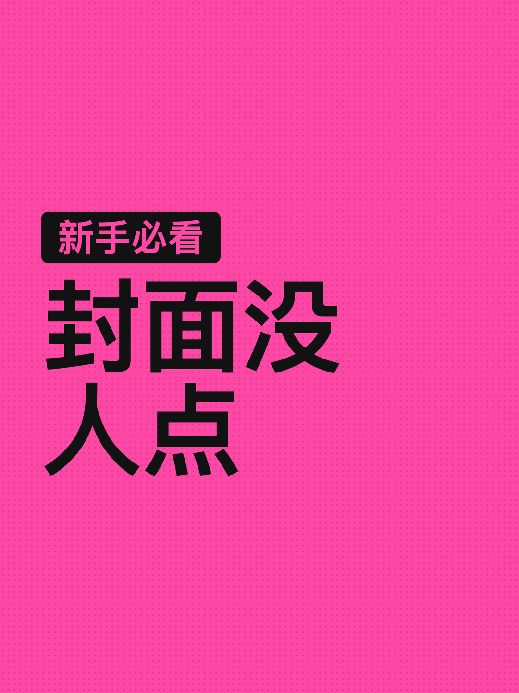
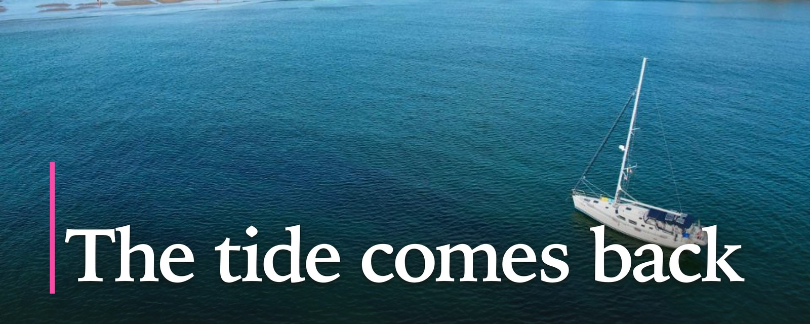

# Examples

Every cover below came out of one `beastcover` command, shown above it. This folder is also the visual regression set: after changing a template or the layout, run `pnpm examples` and compare the changed files against git by eye.

Photos come from Openverse (CC0 or public domain, credits at the bottom). The face is an AI-generated demo person, stored as the input asset `assets/face.jpg`: in real use this is where your own photo goes.

## Face on a poster

The breakout-thumbnail formula in one command: an expressive face cut out on the machine, sized so the face carries the frame, a four-character hook, a loud background. One run makes the landscape and the portrait version.

```bash
beastcover gen "我看傻了" --template poster --subject your-photo.jpg --preset youtube,xiaohongshu
```

 

## Before and after

The compare template, pointed at the product itself: a plain headline cover versus the face poster.

```bash
beastcover gen "就差这一步" --template compare --before plain.png --after loud.png --labels "改前,改后" --preset youtube
```



## A photo that does the shouting

A free stock photo with real tension, the subject kept clear of the headline, `--look punch` for saturation and contrast.

```bash
beastcover gen "离岩浆50米" --source stock --photo openverse:ffe36656-7f80-45fe-a390-ab5b50aa2906 --look punch --preset youtube
```



## Callout

The photo's subject circled in red with an arrow from the empty side, the way science and tech channels mark the thing to look at.

```bash
beastcover gen "看这里" --source stock --photo openverse:5f19ac60-f04c-4504-9d94-4a846c503566 --callout --preset youtube
```



## Number hook

A huge figure beside a short, sharp line.

```bash
beastcover gen "个错误毁了我" --template number --number 3 --preset youtube
```


## Poster with a tag

Full-bleed colour, huge type, a small label above the headline.

```bash
beastcover gen "封面没人点" --template poster --tag "新手必看" --preset xiaohongshu
```



## Ultrawide article cover

The X article banner (WeChat is cut from the same master). Wide photo, headline on the calm water.

```bash
beastcover gen "The tide comes back" --source stock --photo openverse:d788f4c8-9d3d-40cf-8784-02d2573ce9a0 --preset x
```



## Painted through your own agent CLI

The catalog style prompt painted by a local agent CLI (`--via agy` here). Not part of `pnpm examples`: repaint by hand when a style changes. Stored as jpeg to keep the repository small.

```bash
beastcover gen "一个人独自坐在深夜的书桌前，屏幕的光照亮他的脸" --source agent --via agy --style luminous_impasto --preset youtube
beastcover gen "三个习惯" --source agent --via agy --preset youtube
```

 

## Credits

Photos via [Openverse](https://openverse.org), CC0 or public domain: [lava and helicopter](https://www.flickr.com/photos/27784370@N05/16285896735) by USGS, [sailboat](https://stocksnap.io/photo/sailing-boat-6HIAAM72PR), [airplane](https://stocksnap.io/photo/airplane-sky-YNUT4JAZ0V). The demo face is AI-generated; no real person appears in these covers.
